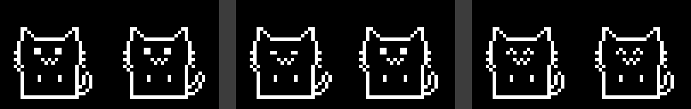

# Pixel Pet

A tiny Tamagotchi-style desk pet starring my two Nebelung cats, Cheddar and Halloumi. Built on an ESP32 with a 0.96" OLED, two inputs and a buzzer.

<!-- TODO: replace with a real photo or short video of the device -->

## Why
I want to build a cheap, repeatable gift for friends who are stressed or lonely: something small to look after that reacts when you pay it attention. This is the first prototype. The pets can be customised before gifting (names, breed sprite, markings like Halloumi's white chest patch).

## What it does
| You do | The cat does |
|---|---|
| Tap | Hops, shows a heart, chirps |
| Double tap | Gets brushed: eyes shut, purrs for the whole brush |
| Hold 3 seconds | A bowl fills while you hold, then the cat eats |
| Ignore it for a minute | Falls asleep |
| Forget to feed it | Gets hungry: frowns, meows, ignores pats until fed |
| Nothing | Grooms itself, scratches its post, watches a passing butterfly |

Each cat has its own input (Cheddar: touch pad, Halloumi: button), its own mood and its own timers.

## What broke, and what I changed
- **Pats fired before feeds.** Holding to feed first triggered a pat, so every meal started with a heart. Now a quick tap is a pat, a hold shows a bowl filling up, and you only get one or the other.
- **Taps felt slow and "ignored".** Partly a design choice (hungry cats ignore pats), which looked like broken input. Hungry cats now answer a pat with a "mew?".
- **Everything happened at once.** Grooming, scratching and butterfly timers ran out while the cats slept, so waking them set all three off together. Automatic actions now wait for 8 calm seconds and run one at a time.
- **Clap-to-wake is unreliable.** The analog sound sensor can't tell speech syllables from claps very well. I added "short, loud, after silence" rules, then decided to swap the mic for a light sensor (sleep when the room goes dark) and a knock sensor.

My first ESP32 project, a garage door alert, stalled because it only ran off my laptop and I didn't plan the hardware. This one runs off a USB wall charger and was built in small stages, each tested on the device before moving on.

## How it's built
The code is split so the pet can move to new hardware without a rewrite:

- `pet_logic`: moods, timers and rules. No hardware calls.
- `input`: turns touch, button and mic into events (pat, brush, feed, clap).
- `output_oled` / `output_sound`: turns moods into pictures and sounds. The only part that changes for a new screen.
- `board_config.h`: every pin number in one place.
- `pet_config.h`: names, markings, timers. What you edit before gifting.

Hardware: Keyestudio ESP32 (ESP32-WROOM-32) on an IO shield, SSD1306 128x64 I2C OLED, touch module, push button module, analog sound sensor, passive buzzer. Pinout and wiring are in [`docs/`](docs/).

## Next
- Swap the mic for a light sensor and a knock sensor
- A 3D-printed "little house" case
- Poke the cats from a phone over Wi-Fi
- Move to a LILYGO T-QT Pro (ESP32-S3, colour screen, battery) for the gift version

## License

All rights reserved. This code is published for viewing only. You may not use, copy, modify or distribute it without my written permission. To request permission, see [my GitHub profile](https://github.com/josiahwyk) for contact details. See [LICENSE](LICENSE).
